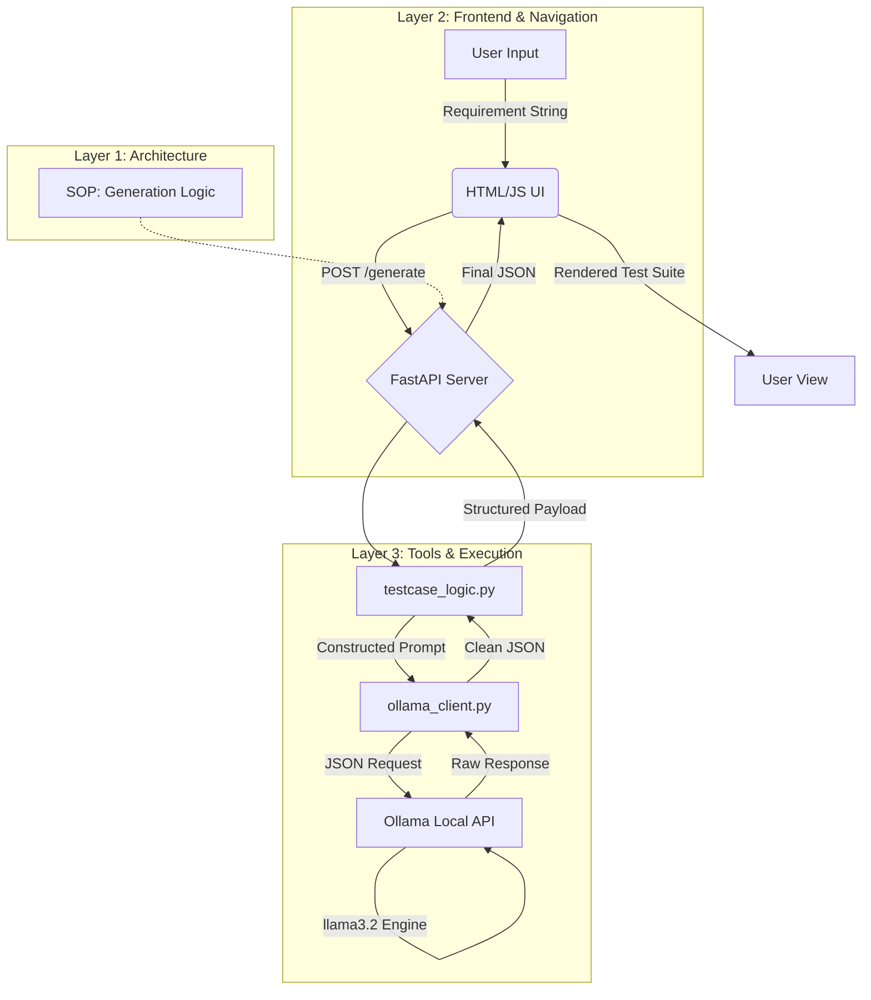

# 🤖 Local LLM TestCase Generator (Testcase Pilot)

A professional, local-first test case generator built using the **B.L.A.S.T.** protocol and **A.N.T.** (Architecture-Navigation-Tools) 3-layer architecture. This tool leverages local LLMs via **Ollama** to provide comprehensive, high-quality test suites with 100% data privacy.

---

## 🏗️ How it Works (System Architecture)

The system is designed to separate probabilistic AI logic from deterministic execution layers.



---

## ✨ Key Features
- **100% Local**: No data leaves your machine. Powered by `llama3.2` via Ollama.
- **Premium UI**: Modern glassmorphism chat interface with smooth animations.
- **Structured Output**: Generates valid JSON test cases ready for integration or documentation.
- **Scalable Architecture**: Built on the 3-layer A.N.T. framework for reliability.

---

## 🚀 Getting Started

### Prerequisites
1. **Ollama**: Install from [ollama.com](https://ollama.com).
2. **Model**: Pull the required model:
   ```bash
   ollama pull llama3.2
   ```
3. **Python**: v3.8+ recommended.

### Installation
1. Clone the repository:
   ```bash
   git clone https://github.com/anchaljunejaa/Local-LLM-TestCase-Generator.git
   cd Local-LLM-TestCase-Generator
   ```
2. Install dependencies:
   ```bash
   pip install -r requirements.txt
   ```

### Running the Application
1. Start the backend:
   ```bash
   # On Windows (PowerShell)
   $env:PYTHONPATH="."; python backend/server.py
   
   # On Linux/macOS
   PYTHONPATH=. python3 backend/server.py
   ```
2. Open your browser and navigate to:
   ```
   http://localhost:8000
   ```

---

## 📁 Project Structure
- `backend/`: FastAPI server (Navigation Layer).
- `frontend/`: Glassmorphism UI (HTML/CSS/JS).
- `tools/`: Deterministic execution scripts (Execution Layer).
- `architecture/`: Strategic SOPs (Decision Layer).
- `requirements.txt`: Project dependencies.

---

## 🛠️ Built With
- **Ollama** & **llama3.2**
- **FastAPI** (Python)
- **Vanilla JS/CSS** (Premium UI)
- **B.L.A.S.T.** Protocol (Blueprint, Link, Architect, Stylize, Trigger)
